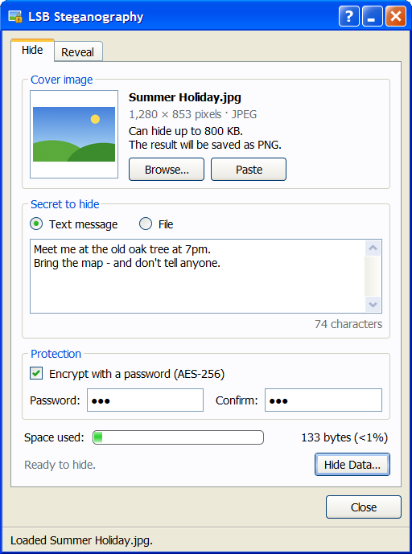
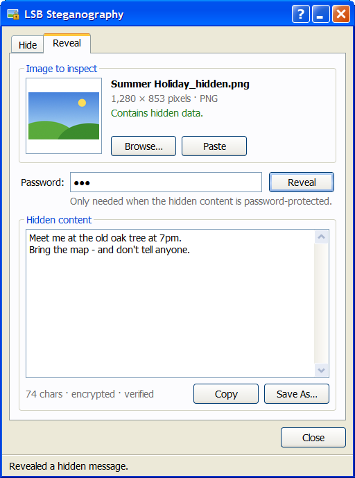

# LSB Steganography

Hide a message or a whole file inside a picture, then get it back later. The app
is a Windows XP–style dialog, and the original command-line scripts still work.

| Hide | Reveal |
| --- | --- |
|  |  |

## Quick start

1. Double-click **`LSB Steganography.bat`**.
   The first run sets everything up, which takes about a minute. Later runs start straight away.
2. **Hide:** choose a cover picture (Browse, drag and drop, or Ctrl+V). Type a message or pick a file.
   Optionally tick *Encrypt with a password*, then click **Hide Data…** and save the PNG.
3. **Reveal:** open that PNG on the Reveal tab. A message appears in the box, and a hidden file
   can be saved with **Save File…**. If the content is protected, type the password and click
   **Reveal**.

You can also drop a picture onto `LSB Steganography.bat`. The app opens on the right tab:
Reveal if the picture holds hidden data, Hide if it doesn't.

## What the setup does

| File | Purpose |
| --- | --- |
| `setup.bat` | Finds Python 3.10+ with Tkinter and installs [Poetry](https://python-poetry.org) through pipx if it's missing. It then creates `.venv` in this folder, installs the locked dependencies, and adds a `LSB Steganography` shortcut here. It's safe to run again; run it after pulling changes. |
| `LSB Steganography.bat` | Starts the app without a console window, running `setup.bat` first if needed. |
| `build_exe.bat` | Builds `dist\LSBSteganography.exe`, a single file that runs on PCs without Python. |

Dependencies are managed by Poetry (`pyproject.toml` + `poetry.lock`); `poetry.toml` keeps the
virtual environment inside the project. If you prefer the command line:

```bash
poetry install --with dev     # create .venv and install everything
poetry run lsb-stego          # the GUI
poetry run lsb-encode         # interactive CLI, same prompts as the old encode.py
poetry run lsb-decode         # interactive CLI, same prompts as the old decode.py
poetry run pytest             # 53 tests: engine (incl. 5 MB round trip), CLI, GUI at 4 DPI scales
```

`python encode.py` and `python decode.py` still work from inside the virtual environment.

## How it works

Every pixel has red, green and blue values from 0 to 255. Changing the lowest bit of each one
changes the colour by at most 1/255, which the eye can't see. Those bits carry the data.
At 1 bit per channel a picture holds `width × height × 3 / 8` bytes.

When a secret doesn't fit, the app switches to **2-bit mode** automatically: it uses the
two lowest bits of each channel. That doubles the room, and each channel still changes by
at most 3/255. The *Space used* bar is green in 1-bit mode, yellow in 2-bit mode, and red
when the secret doesn't fit.

| Cover picture | 1-bit mode | With 2-bit mode |
| --- | --- | --- |
| 1920×1080 (2 MP) | 759 KB | 1.5 MB |
| 3264×2448 (8 MP phone photo) | 2.9 MB | 5.7 MB |
| 4000×3000 (12 MP, typically a ~5 MB JPEG) | 4.3 MB | 8.6 MB |

**5 MB in, 5 MB out:** hiding a 4.7 MB photo inside a 4.7 MB / 12 MP photo takes about
1 second, and revealing it takes under 1 second. The extracted file is byte-for-byte
identical, and peak memory use is about 130 MB.

Data is written in this layout (big-endian):

```
MAGIC "LSB\x02" | flags u8 | length u32 | CRC-32 u32 | blob
flags = 0x01 compressed | 0x02 encrypted | bits 2-3: bits per channel - 1
blob  = inner → zlib-compressed if smaller (flag 0x01) → AES-256-GCM if a password is set (flag 0x02)
inner = kind u8 (0 text, 1 file) | name length u16 | file name (UTF-8) | data
```

The 13-byte header is always stored at 1 bit per channel, so a reader can find the mode
before reading the rest. Secrets that are already compressed, such as photos, ZIPs and
videos, are detected from a sample and stored as they are rather than being zipped again.

* **Password protection:** the key is derived with scrypt (N=2¹⁵, r=8, p=1) and the data is
  encrypted with AES-256-GCM. The file name is encrypted too.
* **Integrity:** a CRC-32 over the stored blob. A picture that was edited or recompressed is
  reported as *damaged*, not as a wrong password.
* **Output is always PNG.** If you ask for `.jpg`, the file is saved as `.png`, because JPEG
  compression would destroy the hidden bits.
* **Backward compatible:** pictures made with the original `encode.py` (red channel only,
  ending in four zero bytes) still decode. They're labelled *old format, unverified*.

### BPCS mode

Use the **Method: LSB / BPCS** switch at the top of the app (or answer `B` in `lsb-encode`)
to hide and reveal with **Bit-Plane Complexity Segmentation** instead. The switch applies to
both tabs. LSB changes the lowest bit of every channel.
BPCS changes whole 8×8 blocks, and only where the picture already looks like noise:

1. Each R, G and B value is converted to Gray code, and each of its lowest 4 bit-planes is cut
   into 8×8 blocks.
2. A block's *complexity* is its number of black/white borders out of 112. Blocks at 0.3 or
   above count as noise and are replaced with 63 secret bits each.
3. A secret block that is too simple is *conjugated* (XORed with a checkerboard) so it still
   looks like noise, and a flag bit records it so it can be undone.

Smooth areas such as sky are never touched, and no channel changes by more than 15 levels.
How much fits depends on the picture: busy photos can hold more than LSB, while flat graphics
and screenshots may hold nothing. The cover note shows both figures. BPCS uses the same
header (with magic `BPC\x01`), compression, password protection and integrity check.
**Reveal** reads with the selected method. If the picture was hidden with the other one, it
says so and offers a one-click *Use BPCS* / *Use LSB* button. `lsb-decode` detects the method
by itself.

### See where the data is

On the **Reveal** tab, **Show Where…** opens a map of the picture with every pixel that holds
hidden data marked in red. No password is needed, because the header that says where the
data is isn't encrypted.

* **Map:** the whole picture, washed out to grey, with the data pixels in red. When the
  picture is shrunk to fit, a single data pixel still shows.
* **Magnifier:** the 15×15 pixels around the selected one, drawn large, with data pixels
  outlined in red.
* **Selected pixel:** its red, green and blue values as 8 bits each, with the bits that hold
  hidden data filled in red. For LSB that's the lowest bit (or two). For BPCS it's one bit of
  the Gray-coded value, in one channel only, because BPCS works on whole 8×8 blocks of a
  single bit-plane.

Click the map or the magnifier to pick a pixel, or move with the arrow keys (Shift+arrow moves 8
pixels). **Save Map…** saves the full-size map as a PNG.

### Before and after

To show what changed, the window needs the original picture, because the colours from before
hiding aren't stored anywhere. There are two ways to give it:

* After **Hide Data…**, click **Show Changes** in the "now hidden" message. The app still has
  the original, so it compares straight away.
* In **Show Where…**, click **Compare with Original…** and choose the cover picture. The app
  checks that it really is the original: same size, and no differences outside the hidden data.

The selected pixel is then shown as a before → after table:

| | Before | | After | Change | Hidden bit = which bit of the message |
| --- | --- | --- | --- | --- | --- |
| R | `1001111`**`0`** 158 | → | `1001111`**`0`** 158 | 0 | 0 = bit 7 of name length |
| B | `1011010`**`1`** 181 | → | `1011010`**`0`** 180 | −1 | 0 = bit 1 of letter 'M' (**0**1001101) |

* **Red** bits changed. **Amber** bits hold hidden data but already had the right value, so
  they didn't need to change. With LSB about half the hidden bits are amber, which is why no
  value moves by more than 1.
* The last column says what each hidden bit is: part of the marker, the length, the CRC, or a
  letter of the message, with that letter's 8 bits and the one stored here picked out. With a
  password the bytes are encrypted, so it says *encrypted byte* instead.
* For BPCS the bits are shown in Gray code, where BPCS works, with the colour values beside
  them. A line under the table explains the block, its bit-plane, and whether it was conjugated
  (flipped in a checkerboard pattern so it still looks like noise).

## Fixed from the original scripts

* `requirements.txt` held a shell command instead of a package list. It's replaced by Poetry.
* Hidden files were cut short at the first run of four zero bytes, which most ZIP, PDF, PNG and
  EXE files contain. Decoded text also ended with stray NUL characters.
* Characters above U+00FF, such as emoji, Chinese or Cyrillic, were corrupted because of
  `format(ord(c), '08b')`. Text is now stored as UTF-8.
* Grayscale and palette images crashed. JPEG output silently destroyed the payload.
* There was no capacity check, so data that didn't fit was silently truncated.
* Per-pixel `getpixel`/`putpixel` made large images take minutes. NumPy now hides a 5 MB file
  in a 12 MP photo in about a second.

## Limits

* Share the PNG as a file, for example by email, a cloud drive or USB. Most chat apps and
  social networks shrink or recompress images, which erases the hidden data.
* LSB hiding can be detected by statistical analysis. A password keeps the content secret,
  but not the fact that something is hidden.
* The GUI accepts secret files up to 100 MB. The cover picture sets the real limit.

## Sounds

On Windows the app plays an XP-style startup chime when it opens, a click when you press a
button, and key sounds as you type in a text box. Each kind of key sounds different:

| Key | Sound |
| --- | --- |
| Letters, digits, symbols | a soft tap; each key always plays its own note |
| Capital letters | a brighter double tap |
| Space, Tab | a deeper thud |
| Backspace, Delete | a tap that falls in pitch |
| Enter | a solid "thock" with a small ding |

All the sounds are synthesised by the app (Microsoft's own XP sound files can't be bundled).
To use your own, copy WAV files into `%LOCALAPPDATA%\LSB Steganography\sounds\` named
`startup.wav`, `click.wav`, `key.wav` (all ordinary keys), `capital.wav`, `space.wav`,
`backspace.wav` or `enter.wav`. If no `click.wav` is there, Windows' own *Windows Navigation
Start.wav* (the XP click) is used when available.

## Project layout

```
lsb_stego/
  core.py         engine: container format, LSB embed/extract, legacy reader
  bpcs.py         BPCS engine: bit-plane blocks, complexity, conjugation
  crypto.py       scrypt + AES-256-GCM
  cli.py          interactive encode/decode
  gui/
    app.py        main window (Hide / Reveal)
    chrome.py     Luna title bar and window frame
    widgets.py    XP buttons, checkboxes, tabs, text boxes, scrollbar, progress bar…
    skin.py       renders every control face with Pillow
    icons.py      app icon and XP message-box icons (python -m lsb_stego.gui.icons out.ico)
    dialogs.py    XP message boxes
    datamap.py    Show Where… window: data map, magnifier, bit view
    winapi.py     taskbar button, rounded corners, minimise (ctypes)
    sounds.py     XP-style startup chime, button click and typing taps
tests/            pytest suite
```
